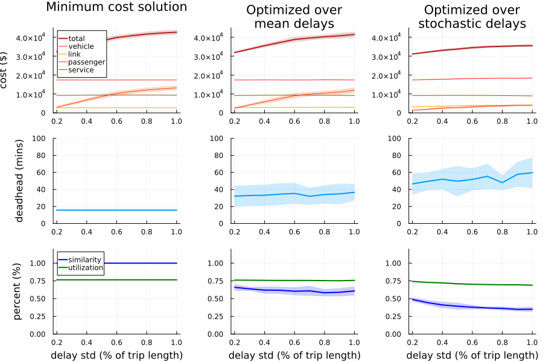
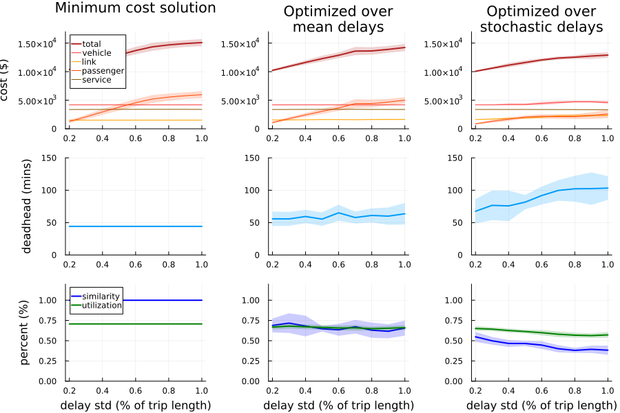
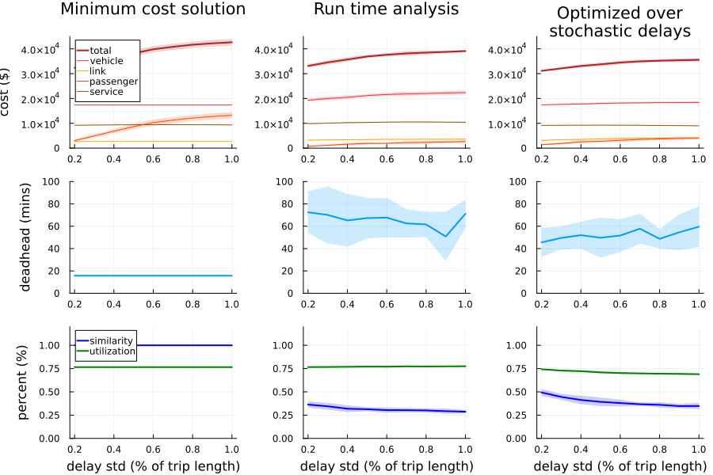
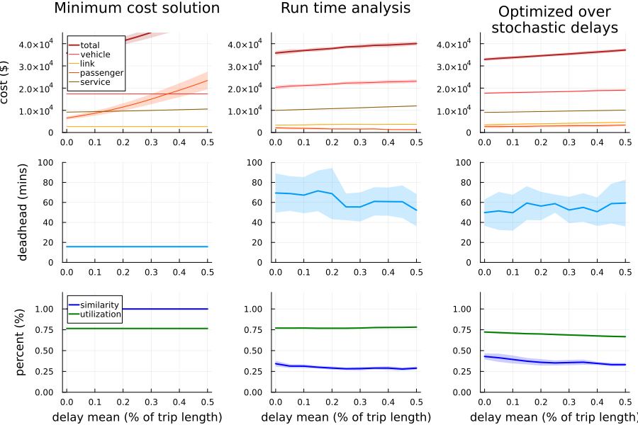
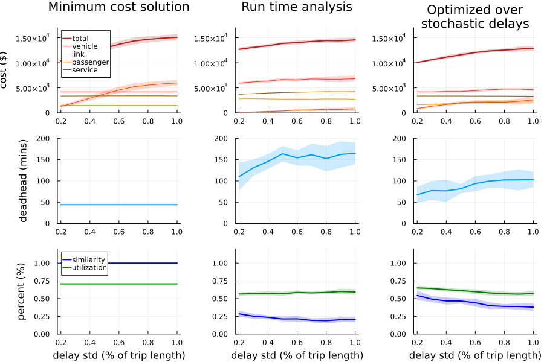
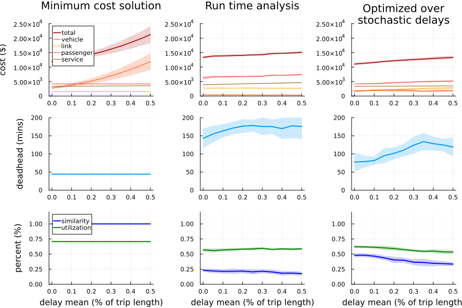

# Transit Delay Management

Tristan Ford

*The University of British Columbia*

## Costs

### Vehicles

[Aber, J. (2016)][1] identifies the lifetime cost of a transit vehicle to be $1.348M US which is nearly $1.9M CAD.  Therefore, using a conservative estimate of $2M CAD as the lifetime cost of purchasing a transit vehicle, we can calculate the ‘daily’ cost of adding a vehicle to the fleet.

Assuming a lifetime of 12 years (as is consistent with the Columbia study), by investing $2M CAD at a 5% rate of return, one could obtain $8,477 CAD biweekly until the investment is paid out.  This comes out to roughly $600 CAD per day, which we use as our cost for adding a new vehicle into the optimization.

### Operational Costs

The BC Transit [Service Plan (2023)][2] notes an estimated cost of operating conventional transit service as roughly $161 CAD per hour in 24/25.  Thus, we use a value of $160 CAD per hour in our model.  This is the cost of any time spent for a vehicle between leaving and returning to the depot.  Furthermore, we translate deadhead distance to time by a fixed average speed of 30 km/hr and apply the same cost to penalize deadheading.

### Passenger Wait Time

[Litman, T. (2016)][3] recommends a waiting time be valued at 100% of wages.  In June 2024, the average hourly wage in BC was $36.63 as reported by [BC Stats (2024)][4].  Therefore, we use an hourly cost of $37 for passenger waiting time in our optimization.

### Pull Out/In Trips

The distance from the depot to/from the start/end of a vehicle schedule is costed at the operational cost level by transforming the distance to time using an average speed of 30 km/hr.  These are called pull out and pull in trips, respectively.

When two trips are separated by 3 hours or more, it is preferable to return to the depot in between as time spent at the depot can be valued at $0.  This also helps in reducing unnecessary increases in vehicle numbers in the model as a singular trip that is far in time from others in a given vehicle schedule can be incorporated without causing undue cost and making use of the same vehicle.

## Data

### Historical

#### Trips

To build vehicle scheduling problem instances, we follow the network flow model wherein each trip is represented by a node in a network.  Two trips are said to be compatible if both may be feasibly operated by the same vehicle, meaning the start and end locations and times are such that one vehicle could operate one trip first and the other afterwards.  Arcs are created between compatible trips in the direction of vehicle flows.  This creates a directed acyclic graph (ignoring the depot) as our instance of the VSP.

To create this graph, we rely upon General Transit Feed Specification (GTFS) data, which is a widely used format for documenting and sharing transit information.  We are able to obtain trip information (including start and stop locations and times) from these files which allows us to create the input graph to the VSP.

#### Delays

TODO: when received from BC Transit

#### Ridership

TODO: when received from BC Transit

### Generated

#### Delays

Each trip will have a distribution of delays that we must understand to properly model the minimization of network delays.  We assume a normal distribution for each trip centered around zero, as the trip length ought to be increased if the average trip delay is much greater than zero.  We can then select a standard deviation as a percentage of each trip’s length to assign a ‘realistic’ delay distribution to each individual trip.  Then, when creating scenarios, we sample each trip’s distribution to obtain a snapshot of the network for one planning horizon.

Each trip delay distribution is given a mean value between -10 to +10% of its trip length, chosen randomly.  The standard deviation is set between 10-50% of its trip length, chosen randomly.  Both upper limits can be specified and we can set a random seed to guarantee reproducible results.

#### Ridership

We assume a uniform distribution between 0-120 passengers as the potential ridership for any given trip.  Each trip in an instance is assigned a value randomly between 0-120 and remains the same for each delay scenario.

The key difference is that ridership is not stochastic in the current model, though it could be in the future.

#### Depot

We are able to specify a depot location `(lat, lon)` and if none is specified, we select the mean starting location of all trips as the depot location.  This somewhat mimics the preference for agencies to position their depots closest to where most of their trips operate.

## Metrics

### Utilization

<span style="color:red">TODO</span>

### Passenger Delay


<span style="color:red">TODO</span>

### Cost


<span style="color:red">TODO</span>

### Similarity

We calculate the similarity of two schedules using the `compareSchedules` function.  This returns the intersection over the union of the adjacency matrices for each schedule.  Schedules which share the same routing of vehicles between trips will have higher similarity.

## Why Use Stochastic Delays?

### Stochastic Delays

We demonstrate the value of considering stochastic delays by analyzing two VSP instances while varying the trip delay distributions.  We create 10 different instances for distribution parameter increment and optimize three models.  The first is the minimum cost solution to the instance, disregarding delay information.  The second is a delay-aware model optimized over the sample mean of each trip delay, only.  The third is a delay-aware model optimized stochastically over the sampled trip delays.  The results are calculated against an unseen sample of delays as to replicate optimizing over historical delay information and performance on real time disruptions.

#### Instance 1: AM Peak

This instance is comprised of a set of key routes in the Nanaimo network, sharing three terminus locations.  We look at all trips between the start of the planning horizon until 10 am which creates an instance with 88 trips.

<p align="center">
  
</p>

We observe that as the trip delay variance increases, the minimum cost solution accrues large passenger delays which begins to increase costs drastically.  The solution optimized over mean delays follows a similar trend, however we can see that the amount of deadheading is slightly larger and the similarity with the minimum cost solution is ~60%.  Therefore, this model is, indeed, selecting links that are reducing passenger delay, as can be seen by the slightly lower passenger costs, yet the adjustments are minimal.  This can be seen by the relatively flat vehicle, link, and service costs.  The stochastically optimized model maintains the lowest overall cost by sacrificing some link and vehicle cost.  We can see the vehicle and link costs begin to increase as the delay variance grows, indicating these solutions are favoring schedules with more vehicles and more buffer time to absorb delays.  Furthermore, this solution has the highest deadheading time.

#### Instance 2: AM Short

The second instance considers some local routes in the Nanaimo network which have many unique terminus locations, yet share a common terminus on one end.  We look at all trips between the start of the planning horizon until 12 pm which creates an instance with 55 trips.

<p align="center">
  
</p>

We observe the same trends as for instance 1, suggesting that the stochastically optimized model is successful in reducing cost over the minimum cost and mean delay-aware models.

## Comparison to Other Solutions

### Run Time Analysis

Run time analysis (RTA) consists of analyzing historical trip run times and adjusting the planned travel time to align with current conditions.  Common practice is to set the planned travel time to allow a given percentile of historical trips to have been made on time - typically a value of 85% is used.  In this section, we simulate performing a RTA on each instance by increasing travel times for all trips to accommodate the 85th percentile of delay scenarios.  We then re-optimize this newly created instance as a minimum cost flow model.

We consider how these models perform when the variance and mean of trip delays change.  We expect the stochastically optimized model to perform the best, in terms of cost, when variance changes as a large variance will mean many trips are also arriving early as well as very late.  Therefore, the RTA model will likely overcompensate by adding significant run time to each trip which will increase cost.  The RTA model is expected to perform better when the mean changes as this likely indicates the planned trip length is no longer suitable.

In the generation of RTA solutions, we assume that the delay distributions would remain the same, regardless of trip length, meaning we simply shift the mean of each trip delay distribution by the amount of travel time added to that trip.  Also, we only adjust the planned arrival time in the original timetable, however in a true implementation of RTA, the timetable would also be revised to accommodate planned transfers and other scheduling requirements.  These are large assumptions which limit the comparisons in this section.

#### Instance 1: AM Peak

<p align="center">
  
</p>

<p align="center">
  
</p>

We see that the stochasically optimized model outperforms the other two in terms of cost in both comparisons.  The RTA model does outperform the others with respect to passenger cost, which makes sense as the travel times for each trip are longer.

#### Instance 2: AM Short

<p align="center">
  
</p>

<p align="center">
  
</p>

Again, we see the stochastically optimized model outperforming the others in both comparisons.  It may be that the 85th percentile is too conservative and it would be interesting to compare with other percentiles.  Moreover, the assumptions listed above limit the validity of the RTA solution.  Because the costs are quite close it is possible that the RTA solution would be less costly with a revision of the original timetable.

## Miscellaneous

### Stochastic Delay Vignette

Consider the mathematical model for our problem,

``` math
\begin{gather*}
\min&\sum_{i,j\in V}c_{ij}x_{ij}+\sum_{k\in\mathcal{S},i\in T}r_is_i^k& \\
\text{subject to:}&x_{ij}\in\mathbb{Z}_+&\forall i,j,\in V \\
&s_i^k\geq0&\forall i\in T,k\in\mathcal{S} \\
&s_i^k\geq\sum_{j\in T}x_{ji}(s_j^k+l_j^k-b_{ji})&\forall i\in T,k\in\mathcal{S} \\
&\sum_{j\in V}x_{ij}=\sum_{j\in V}x_{ji}&\forall i\in V \\
&\sum_{j\in V}x_{ij}=1&\forall i\in T,
\end{gather*}
```

where $s_i^k$ is defined as the amount of time that trip $i$ departs after its scheduled departure time in scenario $k$.  Note, this cannot be negative as trips are not allowed to depart early.  $l_i^k$ is the primary delay for trip $i$ in scenario $k$.

Suppose the mean primary delay for all trips is less than or equal to 0, that is

$$
\frac{1}{|\mathcal{S}|}\sum_{k\in\mathcal{S}}l_i^k\leq0\quad\forall i\in T.
$$

Should we restrict our model to the scenario including only mean primary delays, then we observe that $s_i^k=0$ is optimal and the model collapses to the minimum cost solution.  However, should we sample the distribution of each trip to build multiple delay scenarios, we will inevitably encouter scenarios with positive primary delays (assuming a normal distribution).  As we have established, the minimum cost solution can perform significantly worse than one which considers delays in terms of delay propagation and cost.  Thus, the naive approach of optimizing over the mean primary delay for all trips is not recommended for developing schedules that are robust to system disruptions.

## References

[1]: https://www.columbia.edu/~ja3041/Electric%20Bus%20Analysis%20for%20NYC%20Transit%20by%20J%20Aber%20Columbia%20University%20-%20May%202016.pdf "Aber, J. (2016). Electric bus analysis for new york city transit. Columbia University, 3."
[2]: https://www.bctransit.com/wp-content/uploads/215/749/bct0.pdf "BC Transit (2023). 2023/24 - 2025/26 service plan."
[3]: https://www.vtpi.org/tca/tca0502.pdf "Litman, T. (2016). Transportation cost and benefit analysis II - travel time costs 5.2 travel time and speed."
[4]: https://www2.gov.bc.ca/assets/gov/data/statistics/people-population-community/income/earnings_and_employment_trends_data_tables.pdf "BC Stats (2024). Earnings & employment trends - june 2024."