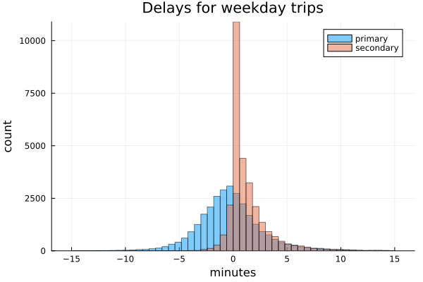
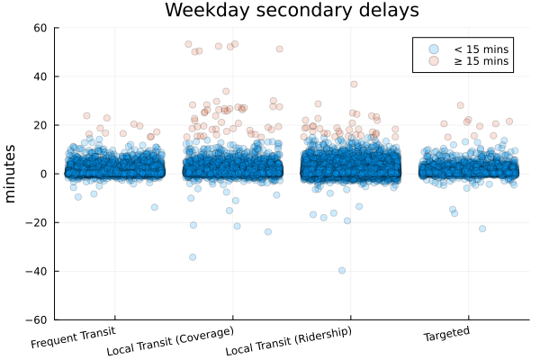
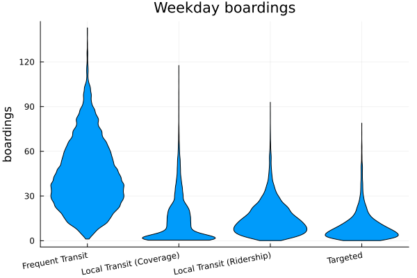
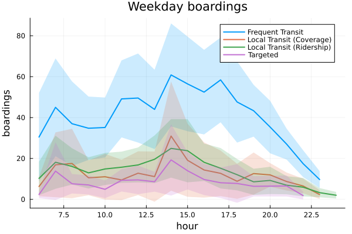

# Transit Delay Management

Tristan Ford

*The University of British Columbia*

## Models

### Minimum Cost Flow

``` math
\begin{gather*}
\tag{1.1}\min_{\mathbf{x}} \quad & \sum_{(i, j) \in \mathcal{E}} c_{ij} x_{ij}\\
\tag{1.2}\text{s.t.} \quad & \sum_{j \in \mathtt{In}(i)} x_{ji} = 1 & \forall i \in \mathcal{T},\\
\tag{1.3}& \sum_{j \in \mathtt{In}(i)} x_{ji} - \sum_{j \in \mathtt{Out}(i)} x_{ij} = 0 & \forall i \in \mathcal{T},\\
\tag{1.4}& x_{i, j} \in \{0, 1\} & \forall (i, j) \in \mathcal{E},
\end{gather*}
```

### Stochastic Delay-Aware

``` math
\begin{gather*}
\min_{\mathbf{x}, \mathbf{y}} \quad & \sum_{(i, j) \in \mathcal{E}} c_{ij} x_{ij} + \frac{1}{S}\sum_{s=1}^S \sum_{i \in \mathcal{T}} h_i y_i^s \tag{2.1}\\
\text{s.t.} \quad & \sum_{j \in \mathtt{In}(i)} x_{ji} = 1 & \forall i \in \mathcal{T}, \tag{2.2}\\
& \sum_{j \in \mathtt{In}(i)} x_{ji} - \sum_{j \in \mathtt{Out}(i)} x_{ij} = 0 & \forall i \in \mathcal{T},  \tag{2.3}\\
& y_i^s \geq \sum_{j \in \mathtt{In}(i)} (y_j^s + \ell_j^s - b_{ji})x_{ji} & \forall i \in \mathcal{T}, s \in \mathcal{S},  \tag{2.4}\\
& x_{i, j} \in \{0, 1\} & \forall (i, j) \in \mathcal{E},  \tag{2.5}\\
& y_i^s \geq 0 & \forall i \in \mathcal{T}, s \in \mathcal{S}. \tag{2.6}
\end{gather*}
```

## Costs

### Vehicles

[Aber, J. (2016)][1] identifies the lifetime cost of a transit vehicle to be $1.348M US which is nearly $1.9M CAD.  Therefore, using a conservative estimate of $2M CAD as the lifetime cost of purchasing a transit vehicle, we can calculate the ‘daily’ cost of adding a vehicle to the fleet.

Assuming a lifetime of 12 years (as is consistent with the Columbia study), by investing $2M CAD at a 5% rate of return, one could obtain $8,477 CAD biweekly until the investment is paid out.  This comes out to roughly $600 CAD per day, which we use as our cost for adding a new vehicle into the optimization.

### Operational Costs

The BC Transit [Service Plan (2023)][2] notes an estimated cost of operating conventional transit service as roughly $161 CAD per hour in 24/25.  Thus, we use a value of $160 CAD per hour in our model.  This is the cost of any time spent for a vehicle between leaving and returning to the depot.  Furthermore, we translate deadhead distance to time by a fixed average speed of 30 km/hr and apply the same cost to penalize deadheading.

### Passenger Wait Time

[Litman, T. (2016)][3] recommends a waiting time be valued at 100% of wages.  In June 2024, the average hourly wage in BC was $36.63 as reported by [BC Stats (2024)][4].  Therefore, we use an hourly cost of $37 for passenger waiting time in our optimization.

### Pull Out/In Trips

The distance from the depot to/from the start/end of a vehicle schedule is costed at the operational cost level by transforming the distance to time using an average speed of 30 km/hr.  These are called pull out and pull in trips, respectively.

When two trips are separated by 3 hours or more, it is preferable to return to the depot in between as time spent at the depot can be valued at $0.  This also helps in reducing unnecessary increases in vehicle numbers in the model as a singular trip that is far in time from others in a given vehicle schedule can be incorporated without causing undue cost and making use of the same vehicle.

## Data

### Historical

#### Trips

To build vehicle scheduling problem instances, we follow the network flow model wherein each trip is represented by a node in a network.  Two trips are said to be compatible if both may be feasibly operated by the same vehicle, meaning the start and end locations and times are such that one vehicle could operate one trip first and the other afterwards.  Arcs are created between compatible trips in the direction of vehicle flows.  This creates a directed acyclic graph (ignoring the depot) as our instance of the VSP.

To create this graph, we rely upon General Transit Feed Specification (GTFS) data, which is a widely used format for documenting and sharing transit information.  We are able to obtain trip information (including start and stop locations and times) from these files which allows us to create the input graph to the VSP.

#### Delays

We have partnered with [BC Transit](https://www.bctransit.com/choose-transit-system/) to obtain historical delay data.  This information provides, on a trip-level, primary delay and secondary delay.  We observe that, despite some trips completing early which corresponds to negative primary delays, there are very few trips which depart early.  This highlights the operational requirement for trips to not start early as this can be frustrating for customers.  Furthermore, though the relative percent of trips with large secondary delays is low, there are still many instances where these large delays do occur.  This data spans roughly three months and each large secondary delay can reasonably be considered an instance where operational interventions are required.

<p align="center">
  
</p>

<p align="center">
  
</p>

#### Ridership

We have partnered with [BC Transit](https://www.bctransit.com/choose-transit-system/) to obtain historical delay data.  This information provides, on a trip-level, the total boardings.  Frequent Transit and Local Transit (Ridership) routes are typically higher frequency and ridership routes.  While Local Transit (Coverage) and Targeted services typically have lower frequencies and ridership.  We also can see that this system has fairly strong ridership spikes in the pm peak, however the morning peak is not as pronounced.  This is a fairly common trend that many transit systems have seen post-pandemic as work-from-home and flexible schedules typically allow for people to avoid the am peak.

<p align="center">
  
</p>

<p align="center">
  
</p>

### Generated

#### Delays

Each trip will have a distribution of delays that we must understand to properly model the minimization of network delays.  We assume a normal distribution for each trip centered around zero, as the trip length ought to be increased if the average trip delay is much greater than zero.  We can then select a standard deviation as a percentage of each trip’s length to assign a ‘realistic’ delay distribution to each individual trip.  Then, when creating scenarios, we sample each trip’s distribution to obtain a snapshot of the network for one planning horizon.

Each trip delay distribution is given a mean value between -10 to +10% of its trip length, chosen randomly.  The standard deviation is set between 10-50% of its trip length, chosen randomly.  Both upper limits can be specified and we can set a random seed to guarantee reproducible results.

#### Ridership

We assume a uniform distribution between 0-120 passengers as the potential ridership for any given trip.  Each trip in an instance is assigned a value randomly between 0-120 and remains the same for each delay scenario.

The key difference is that ridership is not stochastic in the current model, though it could be in the future.

#### Depot

We are able to specify a depot location `(lat, lon)` and if none is specified, we select the mean starting location of all trips as the depot location.  This somewhat mimics the preference for agencies to position their depots closest to where most of their trips operate.

## Metrics

### Utilization

<span style="color:red">TODO</span>

### Passenger Delay


<span style="color:red">TODO</span>

### Cost

<span style="color:red">TODO</span>

### Similarity

We calculate the similarity of two schedules using the `compareSchedules` function.  This returns the intersection over the union of the adjacency matrices for each schedule.  Schedules which share the same routing of vehicles between trips will have higher similarity.

## Why Not Just Use the Mean?

### Vignette

Consider the stochastic delay-aware mathematical model for our problem, where $y_i^s$ is defined as the amount of time that trip $i$ departs after its scheduled departure time in scenario $s$.  Note, this cannot be negative as trips are not allowed to depart early.  $l_i^s$ is the primary delay for trip $i$ in scenario $s$.

Suppose the mean primary delay for all trips is less than or equal to 0, that is

$$
\frac{1}{\mathcal{S}}\sum_{s=1}^{\mathcal{S}}\ell_i^s=\overline{\ell}_i\leq0\quad\forall i\in\mathcal{T}.
$$

Should we restrict our model to the scenario including only mean primary delays,

``` math
\begin{gather*}
\min_{\mathbf{x}, \mathbf{y}} \quad & \sum_{(i, j) \in \mathcal{E}} c_{ij} x_{ij} + \sum_{i \in \mathcal{T}} h_i y_i \\
\text{s.t.} \quad & \sum_{j \in \mathtt{In}(i)} x_{ji} = 1 & \forall i \in \mathcal{T}, \\
& \sum_{j \in \mathtt{In}(i)} x_{ji} - \sum_{j \in \mathtt{Out}(i)} x_{ij} = 0 & \forall i \in \mathcal{T}, \\
& y_i \geq \sum_{j \in \mathtt{In}(i)} (y_j + \overline{\ell}_j - b_{ji})x_{ji} = \sum_{j \in \mathtt{In}(i)} (y_j - b_{ji})x_{ji} & \forall i \in \mathcal{T}, \\
& x_{i, j} \in \{0, 1\} & \forall (i, j) \in \mathcal{E}, \\
& y_i \geq 0 & \forall i \in \mathcal{T}.
\end{gather*}
```

 then we observe that $y_i=0$ is optimal, as all buffer times of feasible connections are positive, and the model collapses to the minimum cost solution.  However, consider two linked trips, $(i, j)$, in this minimum cost solution.  Let $l_i$ be a random variable representing the primary delay experienced on trip $i$.  Disregarding the effects of delay propagation, the expected secondary delay for trip $j$ is

 $$
\mathbb{E}[y_j]=\mathbb{E}[\max\{l_i-b_{ij}, 0\}]=\mathbb{E}[l_i-b_{ij}\mid l_i>b_{ij}]P(l_i>b_{ij}).
 $$

 If $l_i\sim N(\mu,\sigma^2)$ with probability density function, $f$, then

 $$
\mathbb{E}[y_j]=\int_{x>b_{ij}}xf(x)dx>0.
 $$

Thus, even without delay propagation effects, we can expect a non-zero passeneger delay across all trips.  Moreover, as the minimum cost flow model will choose links with short buffer times, this value may be considerable.  Of course, the shape of the distribution is also an important factor.  For reference, with a cost of $600 per vehicle, $37 per hour of passenger waiting time, and assuming 20 passengers per trip, a network with 50 trips would only require 1 minute of delay on each trip to equal the cost of adding a new vehicle to the fleet.

### Computation

<span style="color:red">TODO</span>

## Comparison with Run Time Analysis

Run Time Analysis (RTA) is a common practice within transit agencies to adjust travel times to current traffic patterns.  For a given trip, historical travel times are analyzed and a new travel time is prescribed that allows for a given percentile of the historical trips to be completed on time - typically the 85th percentile is used.  In rare cases, this may result in shorter travel times.

### Vignette

We propose a slightly more intelligent form of the RTA process which identifies an optimal percentile to minimize costs for each trip.  We label this problem I-RTA.  Consider two trips $i$ and $j$ separated by buffer time $b$ and share a common terminus (no deadheading required).  Let $\ell$ be a random variable representing the primary delay for trip $i$.  $c$ and $h$ represent the cost per hour of service operation and the cost per hour of passenger delay, respectively.  $r_i$ and $r_j$ are the average ridership values for trips $i$ and $j$, respectively. Then we may formulate the I-RTA for trip $i$ as

$$
\min_{t\geq\mathbb{E}[\ell]}\quad ct+hr_i\mathbb{E}[\max\{\ell-t,0\}],
$$

where $t$ is the amount by which the travel time for trip $i$ will be adjusted.  We require $t\geq\mathbb{E}[\ell]$ for practical reasons.  This problem is similar to the [newsvendor model](https://en.wikipedia.org/wiki/Newsvendor_model), and we find that $t^*=\max\{\mathbb{E}[\ell],F^{-1}(1-\frac{c}{hr_i})\}$, where $F$ is the cumulative density function for $\ell$.  If $\ell\sim N(\mu,\sigma^2)$, then $t^*>\mu$ if $r_i>\frac{2c}{h}\approx 8.65$.

The question remains: how does this compare to the delay-aware model?  In this scenario, with two trips, the dominant cost will be the number of vehicles required to operate the service.  Using the I-RTA, we would require an additional vehicle when

$$
t^*=\mu+z\sigma>b.
$$

If $\mu=0$ and $b=\sigma=5$, then we require an additional vehicle when $z>1$ and $r_1\gtrsim 27$.

Using the delay-aware model, if the secondary delay of trip $j$ exceeds the cost of adding another vehicle then we may improve the solution by adding one.  However, this requires more than 16 hours of passenger delay.  Even if $r_j=100$, we would still require an average secondary delay of roughly 10 minutes to justify adding another vehicle.  This may only occur if trip $i$ has severe delay issues, at which point scheduling is likely not the best solution.

Therefore, we show that the delay-aware solution is able to reduce operational costs by trading off passenger delay.  Furthermore, the delay-aware solution considers interactions between all scheduled trips, while the I-RTA is miopic in its optimization.  This will exacerbate the savings yielded through application of the delay-aware solution across large networks.

### Computation

<span style="color:red">TODO</span>

## References

[1]: https://www.columbia.edu/~ja3041/Electric%20Bus%20Analysis%20for%20NYC%20Transit%20by%20J%20Aber%20Columbia%20University%20-%20May%202016.pdf "Aber, J. (2016). Electric bus analysis for new york city transit. Columbia University, 3."
[2]: https://www.bctransit.com/wp-content/uploads/215/749/bct0.pdf "BC Transit (2023). 2023/24 - 2025/26 service plan."
[3]: https://www.vtpi.org/tca/tca0502.pdf "Litman, T. (2016). Transportation cost and benefit analysis II - travel time costs 5.2 travel time and speed."
[4]: https://www2.gov.bc.ca/assets/gov/data/statistics/people-population-community/income/earnings_and_employment_trends_data_tables.pdf "BC Stats (2024). Earnings & employment trends - june 2024."